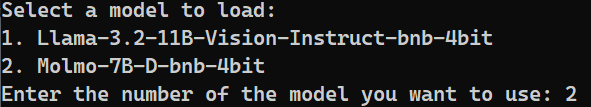

# Clean-UI for Multi-Modal Vision Models

This project offers a user-friendly interface for working with the **Llama-3.2-11B-Vision** and **Molmo-7B-D** models.

In this case, both the **Llama-3.2-11B-Vision-bnb-4bit** and **Molmo-7B-D-bnb-4bit** models need 12GB of VRAM to run.

The model selection is done via the command line:




## Installation

To set up and run this project on your local machine, follow the steps below:

### 1. Clone the Repository

Copy the repository to a convenient location on your computer:

```bash
git clone <repository-url>
cd <repository-directory>
```

### 2. Create a Virtual Environment

Inside the cloned repository, create a virtual environment using the following command:

```bash
python -m venv venv-ui
```

### 3. Activate the Virtual Environment

Activate the virtual environment using:

  ```bash
  .\venv-ui\Scripts\activate
  ```

### 4. Install Dependencies

After activating the virtual environment, install the necessary dependencies from `requirements.txt`:

```bash
pip install -r requirements.txt
```
Install Torch and TorchVision using separate commands:
```bash
pip install torch==2.4.1+cu121 --index-url https://download.pytorch.org/whl/cu121
```
and

```bash
pip install torchvision==0.19.1+cu121 --index-url https://download.pytorch.org/whl/cu121
```
## Usage

To start the UI, you can either:

- Use the **run.bat** script (Windows only)
  
  Simply double-click on `run.bat` or

  1. Activate the virtual environment:
     
     - Windows:
       ```bash
       .\venv-ui\Scripts\activate
       ```

  2. Run the Python script:
  
     ```bash
     python clean-ui.py
     ```

## Features

- Upload an image and enter a prompt to generate an image description.
- Adjustable parameters such as temperature, top-k, and top-p for more control over the generated text.
- Chatbot history to display prompt-response interactions.

## License

This project is licensed under the MIT License. See the [LICENSE](LICENSE) file for more details.
